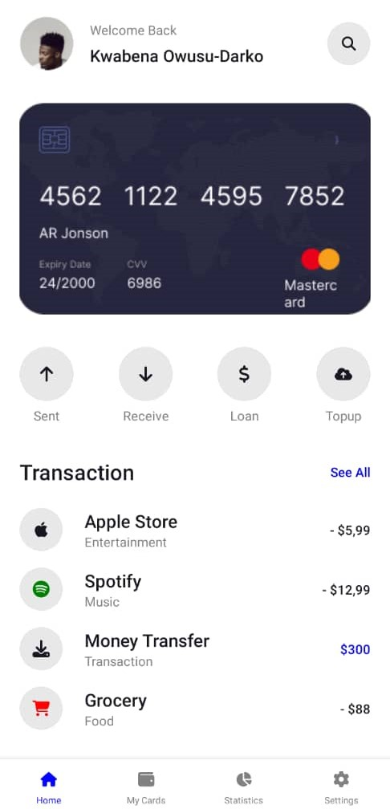
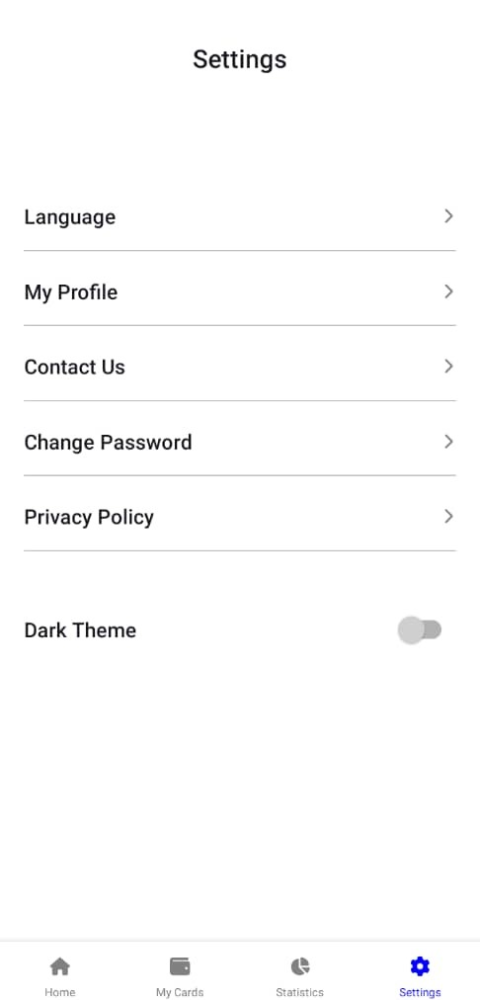
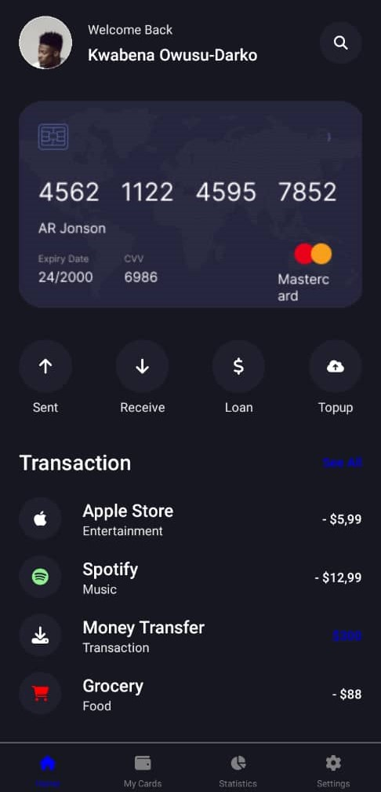
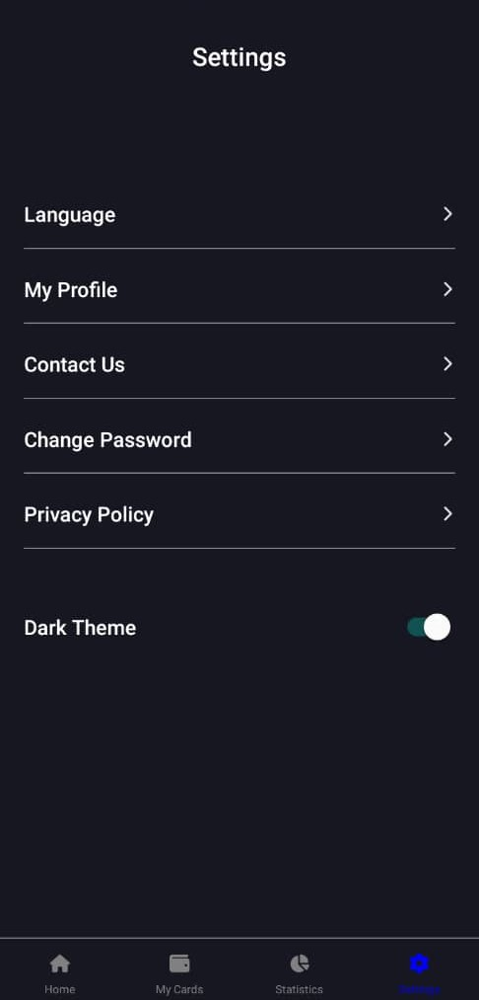

# DCIT 202 Assignment 4
## Kwabena Owusu-Darko (11170189)

This assigment involved converting a figma design of a finance app into a functioning Expo application.

I used Flat lists, Switches, and Images for the components, and implemented light and dark theme modes with React Context.

### The Home Page
This custom component, implemented with Views, a Text Input, Icons, and a few images, simulated a standard ui for a finance mobile application.

### The Settings
This component presented the various setting choices listed in the UI, and implemented a theme toggle using the react native switch element.

Here are a few screenshots of the application:

